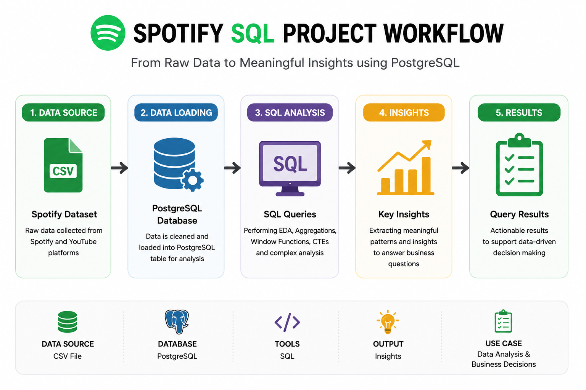

<p align="center">
  
</p>

# Spotify SQL Data Analysis Project

## Project Overview
This project analyzes a Spotify dataset using PostgreSQL.

The objective of this project is to practice:
- SQL querying
- Data cleaning
- Exploratory Data Analysis (EDA)
- Aggregate functions
- Window functions
- Common Table Expressions (CTEs)
- Business-focused analytical queries

This project demonstrates practical SQL skills used in real-world data analytics workflows.

---

# Tools & Technologies
- PostgreSQL
- SQL

---

# Dataset Information
The dataset contains Spotify music streaming data including:

- Artist Name
- Track Name
- Album
- Album Type
- Danceability
- Energy
- Loudness
- Liveness
- Views
- Likes
- Comments
- Streams
- Official Video Status
- Platform Information

---


# Project Workflow

<p align="center">
  
</p>

<p align="center">
  End-to-end workflow of the Spotify SQL Data Analysis Project
</p>

---

# Database Schema

```sql
DROP TABLE IF EXISTS spotify;

CREATE TABLE spotify (
    artist VARCHAR(255),
    track VARCHAR(255),
    album VARCHAR(255),
    album_type VARCHAR(50),
    danceability FLOAT,
    energy FLOAT,
    loudness FLOAT,
    speechiness FLOAT,
    acousticness FLOAT,
    instrumentalness FLOAT,
    liveness FLOAT,
    valence FLOAT,
    tempo FLOAT,
    duration_min FLOAT,
    title VARCHAR(255),
    channel VARCHAR(255),
    views FLOAT,
    likes BIGINT,
    comments BIGINT,
    licensed BOOLEAN,
    official_video BOOLEAN,
    stream BIGINT,
    energy_liveness FLOAT,
    most_played_on VARCHAR(50)
);
```

---

# Data Cleaning

Performed the following cleaning operations:

- Checked total records
- Removed tracks with zero duration
- Verified distinct album types
- Checked streaming platforms
- Validated channel data

Example:

```sql
DELETE FROM spotify
WHERE duration_min = 0;
```

---

# Exploratory Data Analysis (EDA)

Performed basic exploratory analysis including:

```sql
SELECT COUNT(*) FROM spotify;

SELECT COUNT(DISTINCT artist) FROM spotify;

SELECT DISTINCT album_type FROM spotify;

SELECT MAX(duration_min) FROM spotify;

SELECT MIN(duration_min) FROM spotify;
```

---

# SQL Analysis Questions & Solutions

## Easy Level Queries

### 1. Retrieve tracks with more than 1 billion streams

```sql
SELECT *
FROM spotify
WHERE stream > 1000000000;
```

### 2. List all albums with respective artists

```sql
SELECT DISTINCT album, artist
FROM spotify
ORDER BY 1;
```

### 3. Get total comments for licensed tracks

```sql
SELECT SUM(comments) AS total_comments
FROM spotify
WHERE licensed = TRUE;
```

### 4. Find tracks belonging to album type 'single'

```sql
SELECT *
FROM spotify
WHERE album_type = 'single';
```

### 5. Count total tracks by each artist

```sql
SELECT artist,
       COUNT(*) AS total_tracks
FROM spotify
GROUP BY 1
ORDER BY 2 DESC;
```

---

# Medium Level Queries

### 6. Average danceability of tracks in each album

```sql
SELECT album,
       AVG(danceability) AS avg_danceability
FROM spotify
GROUP BY 1
ORDER BY 2 DESC;
```

### 7. Top 5 tracks with highest energy values

```sql
SELECT track,
       SUM(energy) AS highest_energy
FROM spotify
GROUP BY 1
ORDER BY 2 DESC
LIMIT 5;
```

### 8. Tracks with views and likes where official_video = TRUE

```sql
SELECT track,
       SUM(views) AS total_views,
       SUM(likes) AS total_likes
FROM spotify
WHERE official_video = TRUE
GROUP BY 1
ORDER BY 2 DESC;
```

### 9. Total views for each album

```sql
SELECT album,
       track,
       SUM(views) AS total_views
FROM spotify
GROUP BY 1,2
ORDER BY 3 DESC;
```

### 10. Tracks streamed more on Spotify than YouTube

```sql
SELECT *
FROM (
    SELECT track,

    COALESCE(
        SUM(
            CASE
                WHEN most_played_on = 'Youtube'
                THEN stream
            END
        ),0
    ) AS streamed_on_youtube,

    COALESCE(
        SUM(
            CASE
                WHEN most_played_on = 'Spotify'
                THEN stream
            END
        ),0
    ) AS streamed_on_spotify

    FROM spotify
    GROUP BY 1
) AS t1

WHERE streamed_on_spotify > streamed_on_youtube
AND streamed_on_youtube <> 0;
```

---

# Hard Level Queries

### 11. Top 3 most-viewed tracks for each artist using window functions

```sql
WITH top_3 AS (

    SELECT
        artist,
        track,
        SUM(views) AS total_views,

        DENSE_RANK() OVER(
            PARTITION BY artist
            ORDER BY SUM(views) DESC
        ) AS rank

    FROM spotify
    GROUP BY 1,2
)

SELECT *
FROM top_3
WHERE rank <= 3;
```

### 12. Tracks where liveness score is above average

```sql
SELECT artist,
       track,
       liveness
FROM spotify
WHERE liveness > (
    SELECT AVG(liveness)
    FROM spotify
);
```

### 13. Difference between highest and lowest energy values for each album

```sql
WITH cte AS (

    SELECT
        album,
        MAX(energy) AS max_energy,
        MIN(energy) AS min_energy

    FROM spotify
    GROUP BY 1
)

SELECT
    album,
    max_energy - min_energy AS difference_between_max_min
FROM cte
ORDER BY 2 DESC;
```

### 14. Tracks where energy-to-liveness ratio is greater than 12

```sql
WITH cte AS (

    SELECT
        artist,
        track,
        energy,
        liveness,

        ROUND(
            (energy / NULLIF(liveness,0))::numeric,
            2
        ) AS energy_to_liveness_ratio

    FROM spotify
)

SELECT *
FROM cte
WHERE energy_to_liveness_ratio > 12;
```

### 15. Cumulative sum of likes ordered by views using window functions

```sql
SELECT
    artist,
    track,
    SUM(likes) AS total_likes,
    SUM(views) AS total_views,

    SUM(SUM(likes)) OVER(
        ORDER BY SUM(views) DESC
    ) AS cumulative_sum

FROM spotify

GROUP BY 1,2
ORDER BY 4 DESC;
```

---

# Advanced SQL Concepts Used

- Aggregate Functions
- GROUP BY
- ORDER BY
- CASE Statements
- COALESCE
- Window Functions
- DENSE_RANK()
- Common Table Expressions (CTEs)
- NULLIF()
- Type Casting
- Running Totals

---

# Key Learnings

Through this project, I improved my understanding of:

- SQL analytics
- Window functions
- Data cleaning techniques
- PostgreSQL syntax
- Business-oriented SQL problem solving
- Running totals and ranking functions

---

# Future Improvements

- Build Power BI Dashboard
- Add KPI visualizations
- Create interactive charts
- Perform trend analysis
- Add views and stored procedures
 
---


# Project Screenshots

## PostgreSQL Query Execution

<p align="center">
  
</p>

<p align="center">
  
</p>

<p align="center">
  
</p>

<p align="center">
  
</p>

<p align="center">
  
</p>

<p align="center">
  
</p>

---

# Author

Abhishek
BCA Student | Aspiring Data Analyst

